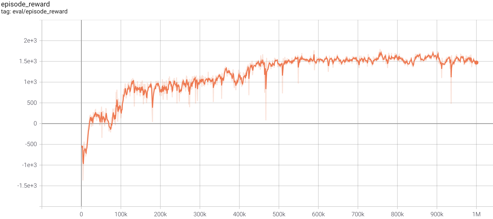

# RL_CARLA
## SAC in Carla simulator
Based on [PARL](https://github.com/PaddlePaddle/PARL) and Torch/Paddle(Baidu deep learning framework), 
a parallel version of SAC was implemented and achieved high performance in the CARLA environment.
> Paper: SAC in [Soft Actor-Critic: Off-Policy Maximum Entropy Deep Reinforcement Learning with a Stochastic Actor](https://arxiv.org/abs/1801.01290)

### Carla simulator introduction
Please see [Carla simulator](https://github.com/carla-simulator/carla/releases/tag/0.9.6) to know more about Carla simulator.

### Benchmark result



+ Result was evaluated with mode `Lane`

## How to use
+ System: Ubuntu 16.04
### Dependencies:
+ Simulator: [CARLA](https://github.com/carla-simulator/carla/releases/tag/0.9.6)
+ RL env: gym_carla

### Integration with MPC 
1. Run the carla server and gui_tools container using
    ```env
    $ watod up carla_server gui_tools 
    ```
2. Inside the gui_tools container, open separate terminals for running mpc and training scripts.

3. For running socket communication, install rosbridge and roslipy for both python and python3.6 using
   ```
   $ sudo apt-get install -y ros-melodic-rosbridge-server
   $ sudo apt-get install -y ros-melodic-tf2-web-republisher
   $ python -m pip install roslibpy
   $ python3.6 -m pip install roslibpy
   ```
4. Export PYTHONPATH for python2.7 if you want to test carla with ros
   ```
   $ export PYTHONPATH="/home/docker/catkin_ws/src/rl_carla_udr/PythonAPI/carla/dist/carla-0.9.6-py2.7-linux-x86_64.egg"
   ```

5. Export PYTHONPATH for python3.6 if you want to use carla for training script
   ```
   $ export PYTHONPATH="/home/docker/catkin_ws/src/rl_carla_udr/PythonAPI/carla/dist/carla-0.9.6-py3.5-linux-x86_64.egg"
   ```
6. Execute roscore, rosbridge-server and ros-tf2-web-republisher in separate terminals 

   ```
   $ source /opt/ros/melodic/setup.bash
   $ roscore 
   $ roslaunch rosbridge_server rosbridge_websocket.launch
   $ rosrun tf2_web_republisher tf2_web_republisher

   ```


7. Use curriculum_ros directory for running mpc node
 ```
  $ cd curriculum_ros/ws/src/
  $ rm -rf CMakelists.txt
  $ cd ..
  $ source /opt/ros/melodic/setup.bash
  $ catkin_make
  $ cd ws
  $ source devel/setup.bash
  $ cd ..
  $ cd src/icra22pkg/scripts
  $ rosrun icra22pkg mpc_controller_wp.py

  ```
  
   
### [Optional] if you are using OPEN AI third party simulator and not modified version 
1. Make sure to remove the gym_carla installation using
```
$ python3.6 -m pip uninstall gym_carla
```

2. Clone the Open Ai's gym_carla using
```
$ git clone https://github.com/cjy1992/gym-carla.git

```

3. Enter the root folder and install it using

```
$ python3.6 -m pip install -r requirements.txt
$ python3.6 -m pip install -e .

```

4. Edit the test.py script under envs folder with the new coordinates for start and destination (from LANE mode) and for addition of actors.

5. Execute the test script to check if the BEV renderer (bird-eyeview) is working or not using
```
$ python3.6 test.py

```


#### If you are using modified carla_env.py script from (https://github.com/ShuaibinLi/RL_CARLA/tree/main/gym_carla)
1. Start the CARLA services inside carla_server container for three CARLA services (ports: 2021,2023,2025) for data collecting and training, one service and one for evaluation (port: 2027,2029).<br>
   (1) non-display mode
    ```start env
    $ /bin/bash -c "SDL_VIDEODRIVER=offscreen SDL_HINT_CUDA_DEVICE=0 ./CarlaUE4.sh  -quality-level=Low -world-port=2021 -nosound -carla-server" 
    ```
   (2) display mode doesn't work
   ```start_env
   $ ./CarlaUE4.sh -windowed -carla-port=2021
   ```
2. Below steps need to be executed in tools container assuming you have mpc node, roscore , rosbridge-server and ros-tf2-web-republisher running    
3. For parallel training, we can execute the following [xparl](https://parl.readthedocs.io/en/stable/parallel_training/setup.html) command to start a PARL cluster:
   ```Parallelization
   $ xparl start --port 8080
   ```
   check xparl cluster status by `xparl status`

3. Start training in a separate terminal
   ```train
   $ python3.6 train.py --xparl_addr localhost:8080
   ```
#### Evaluate trained agent
 Open another(new) terminal, enter the CARLA root folder and launch CARLA service with display mode. 
 ```start_test
 $ ./CarlaUE4.sh -windowed -carla-port=2029
 ```
 Restore saved model to see performance.
 ```
 $ python3.6 evaluate.py --restore_model model.ckpt
